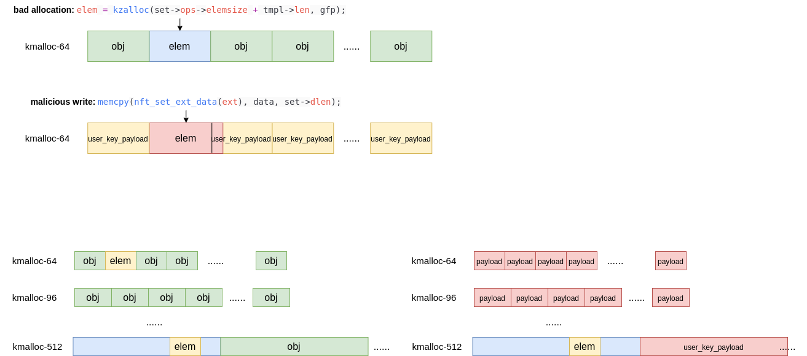
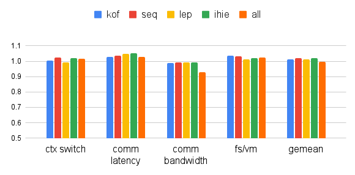

# ERA-eBPF-assisted-Randomize-Allocator

Kernel heap vulnerability is one of the main threats to operating system security today. 

User-space attackers can leak or modify sensitive kernel information, disrupt kernel control flow, and even gain root privilege by triggering a vulnerability. 

However, due to the rapid increase in the number and complexity of vulnerabilities, it often takes a long time from when a vulnerability is first reported to when the developer issues a patch, whereas kernel mitigations are steadily bypassed

so we propose a eBPF assisted Randomize Allocator, inspired by [HOTBPF](https://www.youtube.com/watch?v=1KSLTsgxaSU), but adopt a randomization mechanism, put a vulnerable or potential victim object in the randomize slot in a randomize slab cache.

The average probability of a successful exploitation is about 1/600,000

so that a vulnerable object cannot overlap a victim/payload object. e.g. CVE-2022-34918

the performance and memory overhead are acceptable, only about 1%.

## performance

## memory

the memory and slab relative overhead.

- blue: ERA disabled
- red: ERA **enabled**

.png)

.png)